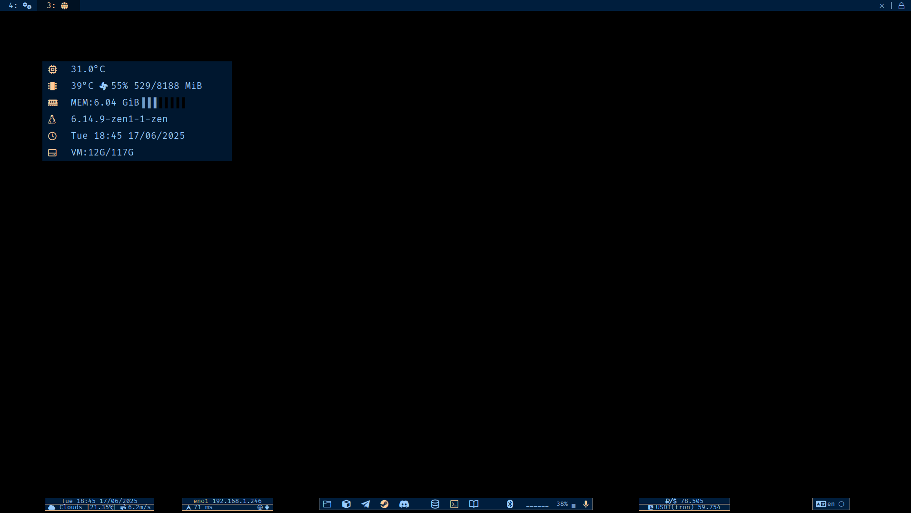

# Polybar 
Here I provide my polybar configuration and scripts
## After installation you'll get something like this:

## Dependencies - Essential
- alacritty awk bash blueman bluetoothctl cava coreutils curl jq nvidia-settings nvidia-utils (AMD analogue) pactl polybar sensors sshd tmux xset
- [OpenWeatherMap API Key](https://home.openweathermap.org/users/sign_in)	
- [FiraCode Nerd Fonts](https://www.nerdfonts.com/font-downloads)
## Dependencies - Optional
- calibre chromium discord obsidian pavucontrol steam telegram-desktop thunar virtualbox
## Installation
- Either fill `./autoconfig/autoconf.ini` with desired values or better edit `config.ini` manually
- *(Optional)* Launch `./autoconfig/autoconf.sh`
- Insert your <ins>OpenWeatherMap API Key</ins> in `./scripts/weather.sh`
- *(Optional)* Change color scheme with `./autoconfig/chcolor.sh`
- Move root directory to `~/.config`

**NOTE**: `./scripts/gputempctl.sh` provides GPU temp. and fan info but also controls it via nvidia-settings. Obviously, it won't work if AMD GPU. 
    
**NOTE**: Workspaces' icons depends on used WM and its configuration.

After some tinkering was made, run `./launch.sh`
